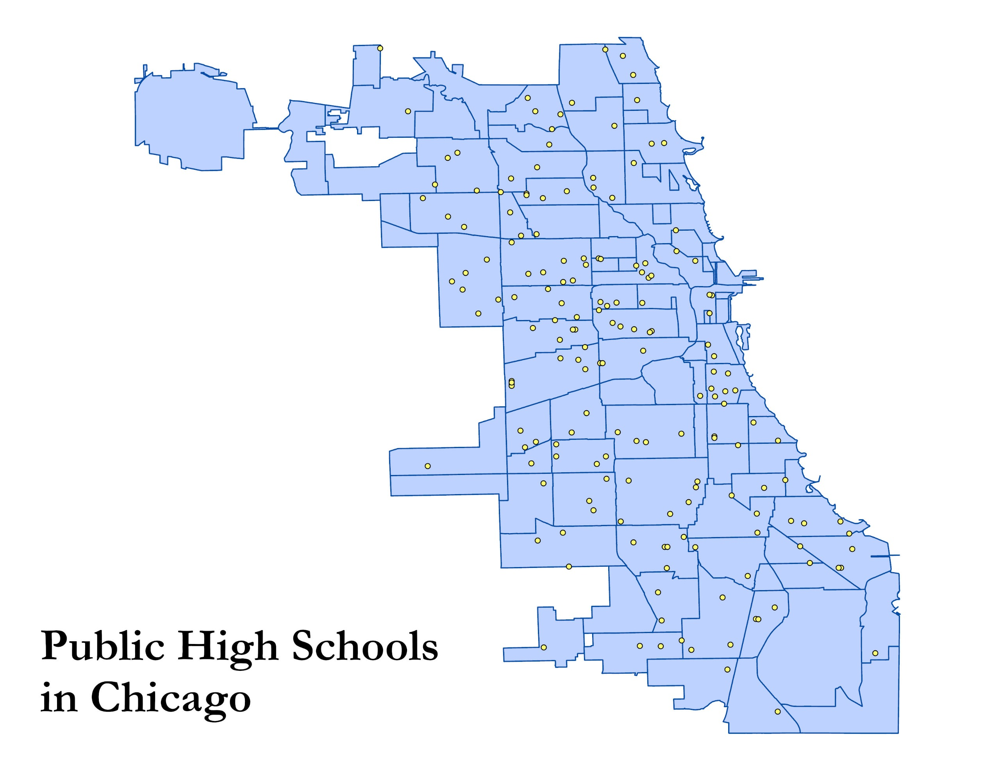

# Chi-Ed - An Interactive Dashboard to Compare Highschools Across Chicago
Authors: Apollinaire Abi, Mehwish Waheed, Muhammad Faizan Imran

## Abstract

Our project aims to provide users with a deep dive into highschool outcomes and metrics across Chicago. Basing our analysis on the Chicago Public Schools (CPS) API data and Illinois Report Card data our goal is to build a comprehensive tool that has all the relevant information in one spot.

For our final product we are aiming to automate PDF generation that provides users with an in-depth comparison across two schools.

We will also be doing a neighborhood level analysis of schools through maps and will attempt to highlight a disparity in outcomes across different neighborhoods.



### Repo Structure

We have gathered the data from different sources that we will be using for this project. The code that fetches Json API can be found under: 


```
└── chi_ed
    └── cps_api
        └── fetching_api_data.py
```

We have created seperate module that have set functions that we can call to fetch, clean, merge and visualize our data and over the coming days we will be working to startng working on the interactive dashboard for the project.

### Data Reconciliation & Cleaning Plan

We have started cleaning the primary data and our next step is to merge the API data with the report card data. Since there isn't a unique identifier that is present in both the datasets we will be setting up a string matching alogrithm that matches schools based on school names and zip codes.

The code that cleans API data can be found here:

```
└── chi_ed
    └── cps_api
        └── cleaning_api.py
```

---

More updates to follow soon!


