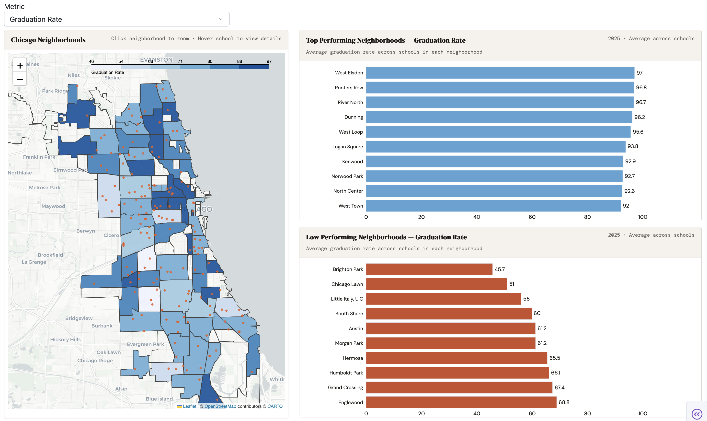
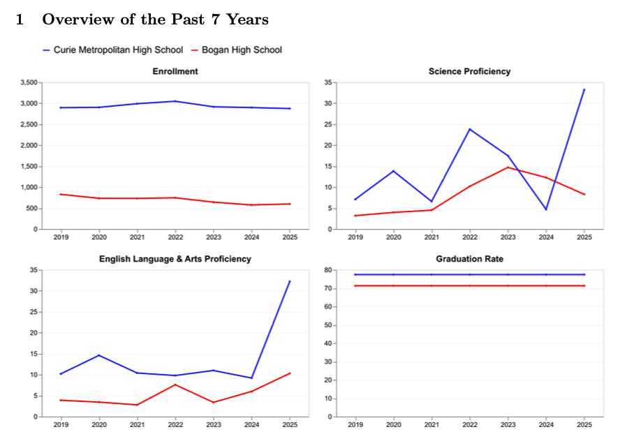
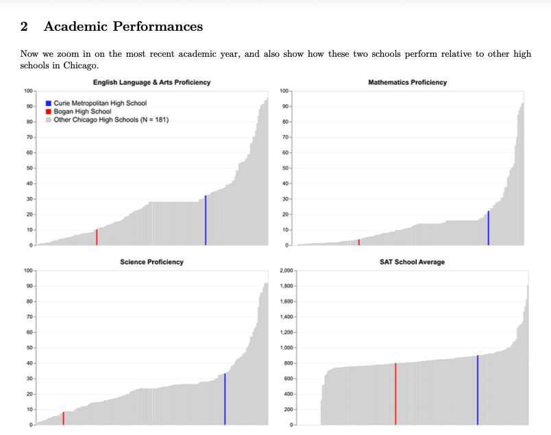
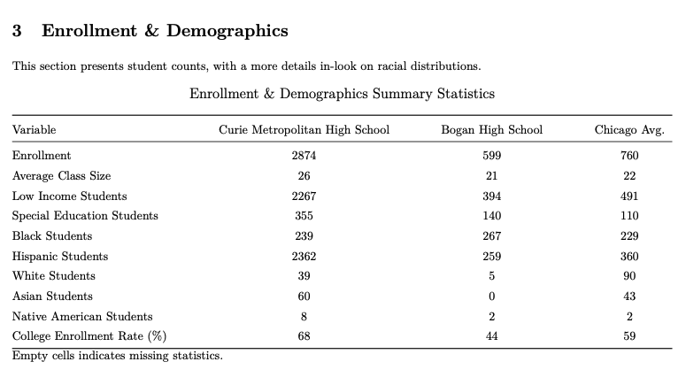

# Chi-Ed - An Interactive Dashboard & Report to Compare Highschool Outcomes Across Chicago
Authors: Essosolim Apollinaire Abi, Mehwish Waheed, Muhammad Faizan Imran

## Abstract

Understanding high school outcomes across a major city like Chicago is important; our project aims to provide an overall aggregation of high schools across various metrics (e.g., graduation rate, college enrollment rate, SAT scores) across different neighborhoods in Chicago and it also allows draws on comprehensive Chicago Public Schools and Illinois Report Card data sets to compare any two schools across a wider range of outcomes and facilities. 

With the dashboard and the report card we aim to facilitate both neighborhood level policy analysis which is aimed at policymakers to visualize and tabulate the disparities in educational outcomes across different neighborhoods and schols. The report card on the other hand provides a tool aimed at individual level decision making, through providing meaningful high school comparisons allowing users to make informed decisions about which high school would align best with their goals.

## Brief Video Describing the Project:

[](https://youtu.be/MkAEJoTCRMA)

## Running the Code

Please follow the following steps and command line instructions to execute and run the project:

1. Clone the repository:

``` 
git clone git@github.com:uchicago-2026-capp30122/project-chi-ed.git
```

2. Install UV and Syncing Packages

```
brew install uv # install uv if needed
uv sync
```

3. Run the cleaning sequence from the project root to get all the files needed to run the dashboard and generate reports:

``` 
uv run python -m chi_ed clean (clean|raw)
```
The second argument in the command line indicates whether to clean from the "raw" files or retrieve the "clean" version with a few final touches. Raw files are not included in this directory but can be downloaded from the source. See `Sources` below. 


4. Execute the dashboard:

``` 
uv run python -m chi_ed dashboard
```

5. Generate reports comparing schools in neighborhoods of your choice:

``` 
uv run python -m chi_ed report
```
Accessed using command line interface, users would need to select neighborhoods and schools within them that they want to compare.

*Dependencies*: For report generation please ensure that you have pandocs installed on your machine. To install pandoc please run:

```
brew add pandoc
```

6. The following command can be used to run some tests, making sure that the data is in the form it should be for the dashboard and report generation:
```
uv run pytest
```

## Dashboard

<p align="center">
  
</p>

## Report Snippets
<p align="center">
  
  
</p>

<p align="center">

</p>  

## Data Sources
Following are the data sources that we used for the project:

- [Chicago Public Schools - All Schools Profile](https://api.cps.edu/schoolprofile/Help/Api/GET-CPS-AllSchoolProfiles): This is our primary data source which contains information on all public schools in Chicago.
- [Illinois State Board of Education - Report Card Data (2009-2014](https://www.isbe.net/pages/illinois-state-report-card-data.aspx): Our second primary source which we merge with the API data to build a comprehensive high school data set.
- [Illinois State Board of Education - Directory of Educational Entities](https://www.isbe.net/Pages/Data-Analysis-Directories.aspx): School directory data set, this was used to perform an intermediary merge, to get zip codes for the our main merge between API data and Report Card data.


