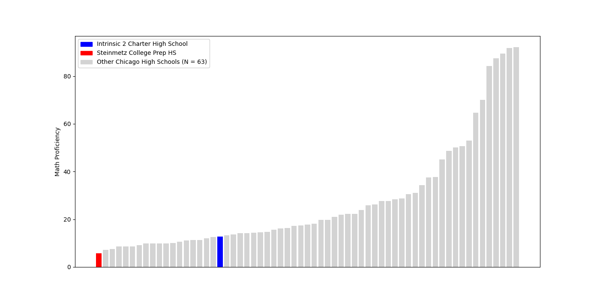
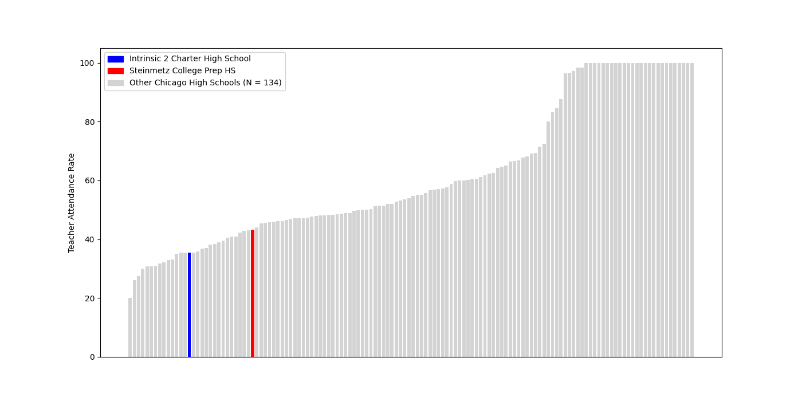

<!--This is a sample report. The final version will be much more flexible, i.e. to handle variables -->

This report compares **Intrinsic 2 Charter High School** and **Steinmetz College Prep HS** across key performance and operational metrics. We also show how these two schools rank compared to other high schools in Chicago. These metrics 
represent the 2024/2025 academic year only. 

## Math Proficiency

\

## Teacher Attendance Rate

\
