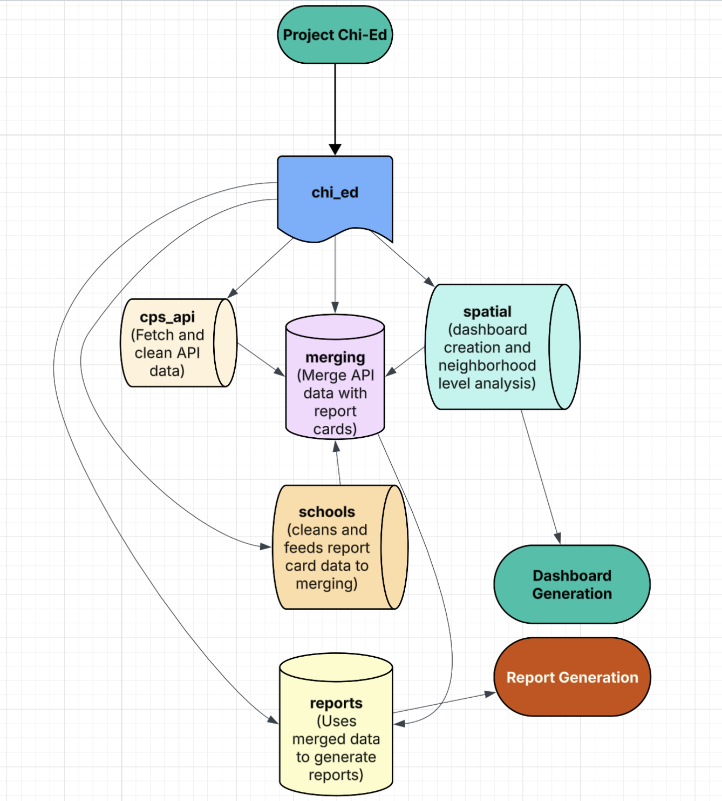

# Chi-Ed

## Data Documentation

### Chicago Public Schools API Date
- Source URL: https://api.cps.edu/schoolprofile/CPS/AllSchoolProfiles
- Source Type: API
- Number of Records (rows): 649
- Number of Attributes (columns): 188

This was our primary data sorce. It contains information on all public schools in Chicago as administered by Chicago Public Schools. The data is for a single year i.e., 2025 and does not contain historical data.

### Illinois State Board of Education - School Report Card Data
- Source URL: https://www.isbe.net/pages/illinois-state-report-card-data.aspx
- Source Type: Bulk data (CSV, XLSX)

This was our secondary data source which contained information on individual school performances on indicators that we use like mathematical efficiency, english language efficiency. We also have panel data available for this data which was used to do a historical anylsis on specific school outcomes.


### Chicago Neighborhood Level Shapefiles
- Source URL: https://data.cityofchicago.org/Facilities-Geographic-Boundaries/Boundaries-Neighborhoods/bbvz-uum9
- Source Type: Shapefile

This is our geospatial data which was used to build the dashboard and do spatial merge to find which schools fall under which neighborhood.


### Directory of Educational Entities
- Source URL: https://www.isbe.net/Pages/Data-Analysis-Directories.aspx
- Source Type: CSV

Auxillary data that we used to merge with report card data to get ZIP codes that we then use as blocking for our main merge between report card data and API data.


## Project Structure



The flowchart above provides a brief overview of our Python application. Other than chi_ed we have the following directories containing the data that we are fetching/creating, tests and reports that are being generated from the command line:


## Team Responsibilites

### Muhammad Faizan Imran

I set up the ```cps_api``` module and the data merging modules in ```merging```. Here is a more detailed breakdown:

- I wrote the script to fetch, clean and store the API Json data. Modules:  ```fetching_api_data.py``` & ```cleaning_api.py```
- The main merging sequences in ```merging``` folder that perform 2 separate merges, ```merge_rc_dir.py``` merges directory data with report card data to get zip codes and the ```merge_api_rc.py``` performs blocking and uses school names for record linkage matching across two data sets, since there was not a unique identifier that we could match on.
- Set up tests to check if the raw API data is being downloaded and stored correctly and another test that checks the cleaning sequence that we perform on the API json data.

### Essosolim Apollinaire Abi:

I cleaned the raw report cards from ISBE and automated the report generation (in pdf) to comparate two specific schools. The scripts in `chi_ed/schools/` and `chi_ed/reports`
are authored by me to either clean the data or create plots and tables which are used in the report. The test file `tests/test_reports.py` tests some functionalities in the
code folders/modules. 
- ⁠ Note on Cache storage: The automated generation of plots and tables for the report will save cache files locally without auto-delection. In the future we want to auto-delete these files or use them as cache to speed up the generation of the reports for pairs of  schools that were previously compared. For now, delete these cache files to save your memory. 
- Data transformation choices: To make our visualizations and tables more "beautiful" and consistent, I filled in missing values using the k nearest neighboors using KNNImputer
from sklearn. I also balanced the panel across 2019 to 2025 which means even inputed data for schools missing from those years. Again this is purely a technical challenge and does not reflect true intended analysis in the real-world scenario.  

### Mehwish Waheed:

I merged the cleaned school panel data with Chicago neighborhood shapefiles to assign each school to its corresponding neighborhood via a spatial join.

From there, I built out the visualizations for the dashboard. For the neighborhood tab, I created an interactive choropleth map of Chicago colored by a user-selected performance metric such as graduation rate, SAT scores, ELA/math proficiency, and wrote functions to display the top 10 and bottom 10 performing neighborhoods for that metric. All charts update dynamically based on the selected year.

I then created a school comparison tab that allows users to select any two schools and compare them directly across key performance metrics, displayed as a grouped bar chart alongside a map of school locations.

## Final Thoughts
The idea for the project came to us during last year's Scopeathon where two of us worked with George Washington Carver Center for Advancement of Science Education, where we worked on highlighting disparities in educational outcomes in the South Side of Chicago compared to other neighborhoods. What stood out during that experience was the need to have some clear visual that one can refer to, to get a sense of just how bad some of the disparities are. We aimed to deliver on that need through the dashboard.

Once we looked at the API and report card data we realized that there was a lot of data that could allow us to automate PDF generation comparing any two schools in Chicago, to inform those looking to start high schools which school in a specific neighborhood aligns best with their interests/goals. To this end we built a CLI to automate report generation. One issue we faced when doing historical analysis was that some of the schools had missing data for some years, and there were a lot of NAs that lead to some metrics being empty.;

There were some shortcomings that we also want to mention and things we would have liked to do differently if we had more time:
- Automate report generation from within the dashboard, becasue CLI is not something most people are fimiliar with and since the tool is meant for Middle School students and parents looking to compare schools it would make most sense to have it embedded withing the dashboard, allowing easy web access.


